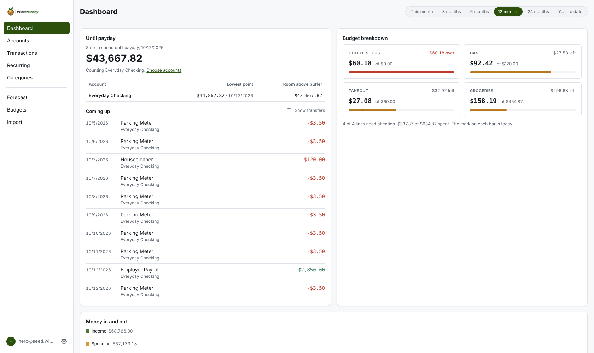
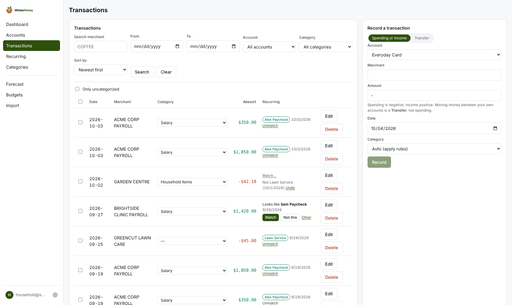
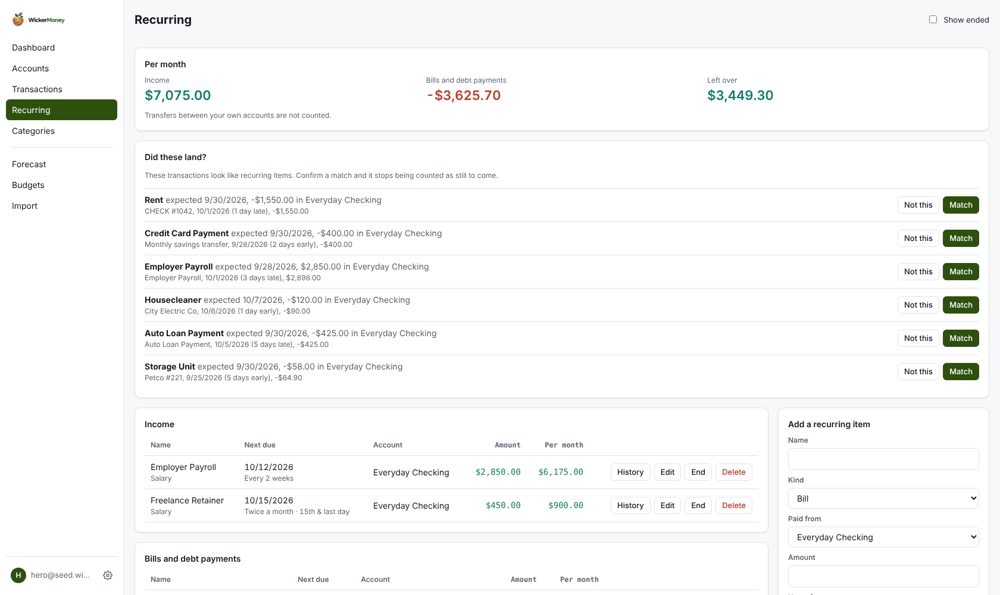
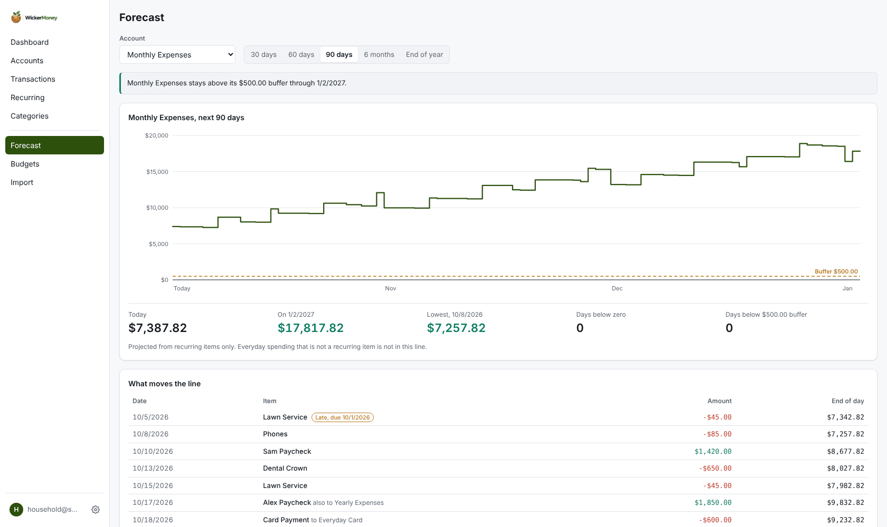
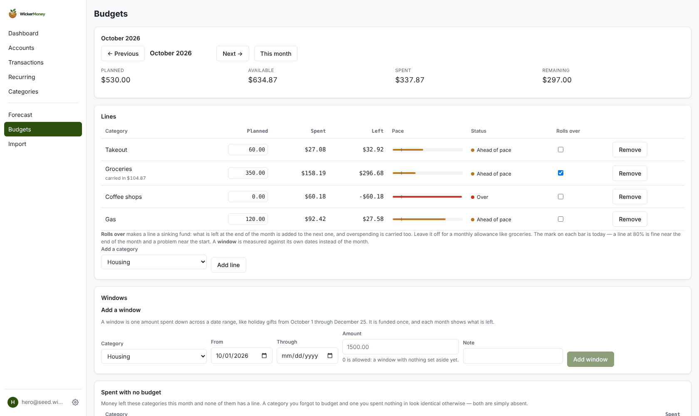
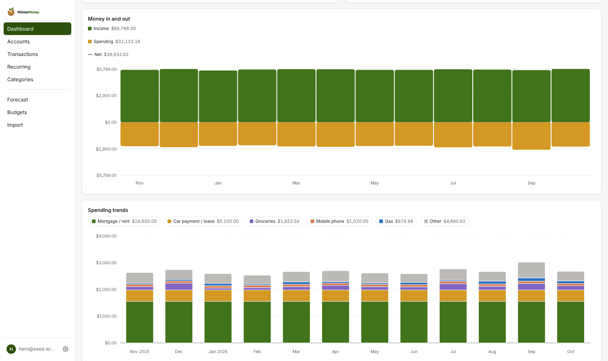
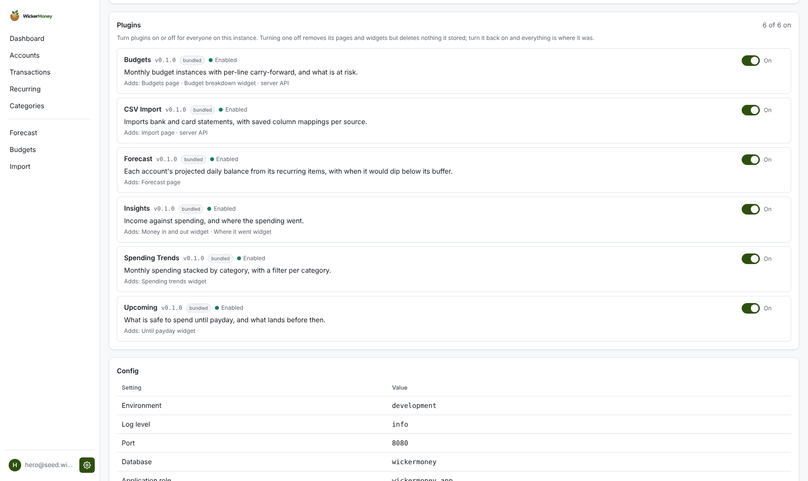

<h1>
  <picture>
    <source media="(prefers-color-scheme: dark)" srcset="apps/web/public/brand/wordmark-dark.png">
    
  </picture>
</h1>

[](https://github.com/wickermoney/wicker-money/actions/workflows/ci.yml)
[](https://github.com/wickermoney/wicker-money/releases/latest)
[](https://github.com/wickermoney/wicker-money/pkgs/container/wicker-money)
[](https://www.npmjs.com/package/@wickermoney/plugin-sdk)
[](https://www.npmjs.com/package/@wickermoney/ui-kit)
[](LICENSE)
[](https://wickermoney.dev)
[](https://www.conventionalcommits.org)

Self-hostable personal finance, rebuilt as a thin core plus installable plugins.

The core owns identity, money movement and the app shell. Everything that
*interprets* money — budgets, forecasting, net worth, FIRE, importers — is a
plugin built against `@wickermoney/plugin-sdk`. A fresh install is useful on its
own; bundled plugins ship enabled and are built against the same SDK a
third-party plugin would use. Plugin code is fully trusted today (see
[Plugins](#plugins)), so third-party plugin install is not supported yet.

<picture>
  <source media="(prefers-color-scheme: dark)" srcset="docs/screenshots/dashboard-dark.png">
  
</picture>

<table>
<tr>
<td width="50%">
<strong>Transactions</strong><br>
<picture>
  <source media="(prefers-color-scheme: dark)" srcset="docs/screenshots/transactions-dark.png">
  
</picture>
</td>
<td width="50%">
<strong>Recurring</strong><br>
<picture>
  <source media="(prefers-color-scheme: dark)" srcset="docs/screenshots/recurring-dark.png">
  
</picture>
</td>
</tr>
<tr>
<td width="50%">
<strong>Forecast</strong><br>
<picture>
  <source media="(prefers-color-scheme: dark)" srcset="docs/screenshots/forecast-dark.png">
  
</picture>
</td>
<td width="50%">
<strong>Budgets</strong><br>
<picture>
  <source media="(prefers-color-scheme: dark)" srcset="docs/screenshots/budgets-dark.png">
  
</picture>
</td>
</tr>
<tr>
<td width="50%">
<strong>Insights</strong><br>
<picture>
  <source media="(prefers-color-scheme: dark)" srcset="docs/screenshots/insights-dark.png">
  
</picture>
</td>
<td width="50%">
<strong>Plugins</strong><br>
<picture>
  <source media="(prefers-color-scheme: dark)" srcset="docs/screenshots/plugins-dark.png">
  
</picture>
</td>
</tr>
</table>

- **Run it:** [Quick start](#quick-start) below, or the full
  [self-hosting guide](https://wickermoney.dev/docs/self-hosting/quickstart).
- **Learn it:** [wickermoney.dev](https://wickermoney.dev) has a page per feature.
- **Change it:** [DEVELOPMENT.md](DEVELOPMENT.md) for the dev setup, database
  roles, tests, plugins and releases, and [CONTRIBUTING.md](CONTRIBUTING.md)
  before a pull request.
- **What's next:** [ROADMAP.md](ROADMAP.md); what changed: [CHANGELOG.md](CHANGELOG.md).

## Features

- **Accounts and transactions.** Checking, savings, credit cards, loans and
  investments, with balances derived from the ledger, never stored. Search,
  filters, and triage tools for anything uncategorized.
- **Categories and rules.** A first-run wizard builds a starter set from a few
  questions about your situation. Rules file new transactions for you, with a
  preview before a rule touches anything. Each category counts as spending,
  income or a transfer, so a refund or a card payment doesn't skew your charts.
- **Transfers.** Money moving between your own accounts is recorded as a linked
  pair, so it is neither income nor spending and every balance stays right.
- **CSV import.** Bank and card statements, with a column mapping saved per
  source, a live date-format preview, duplicate detection and batch undo.
- **Budgets.** One plan per category per month, with optional rollover per
  line (a sinking fund) and a pace marker for today. A *window* covers one
  amount across a date range, such as holiday gifts from October 1 to
  December 25. See [budget windows](https://wickermoney.dev/docs/features/budget-windows).
- **Dashboard.** Widgets from plugins (Until payday, budget breakdown, money in
  and out, spending trends, where it went), all on one time range.
- **Recurring items and "Until payday".** Income, bills, debt payments and
  transfers you expect, and a widget that answers "will I make it to payday?"
  per account against each account's buffer. Match a transaction to the
  occurrence it paid and nothing gets counted twice. See
  [recurring items](https://wickermoney.dev/docs/features/recurring-items),
  [Until payday](https://wickermoney.dev/docs/features/until-payday) and
  [matching](https://wickermoney.dev/docs/features/matching).
- **Forecast.** Each account's projected daily balance from its recurring items,
  30 days to the end of the year, with the first day it would dip below zero or
  its buffer. See [forecast](https://wickermoney.dev/docs/features/forecast).
- **Plugins you can turn off.** An owner turns any plugin on or off from
  Settings, applied live, and its data is kept. See [Plugins](#plugins).
- **Yours.** Self-hosted, one container, PostgreSQL with row-level security
  between users, light and dark themes, and a full JSON export of your data
  from Settings.

How each feature works under the hood is in
[DEVELOPMENT.md](DEVELOPMENT.md#how-the-features-work).

## Quick start

You need Docker. The compose sample runs PostgreSQL 16 for you, or you can
[bring your own](#using-an-existing-postgresql-server). Copy
[`docker/docker-compose.sample.yml`](docker/docker-compose.sample.yml) to
`docker-compose.yml` and review it top to bottom (role names especially, per
[`.env.example`](.env.example)). Put the three secrets it requires in a `.env`
beside it, then start it:

```env
# .env
POSTGRES_PASSWORD=<a long random password>
APP_DB_PASSWORD=<a different long random password>
AUTH_SECRET=<output of: openssl rand -base64 48>
```

```bash
docker compose up -d
```

Open `http://<host>:8180` (set `HOST_PORT` to change it) and create an
account. The first account on an instance is its **owner**, unless you set
`BOOTSTRAP_OWNER_EMAIL` (see [Owners and members](#owners-and-members)); set it
in `.env` before the first start if anyone else can reach the host. Once everyone who
needs an account has one, add `REGISTRATION_ENABLED=false` to the
`wickermoney` service's `environment` and run `docker compose up -d` again.
Serve it over HTTPS before you put real data in it; see
[Behind an HTTPS reverse proxy](#behind-an-https-reverse-proxy-recommended).

To work on the code instead, see [DEVELOPMENT.md](DEVELOPMENT.md#getting-started).

## Running the container image

This is the long form of the quick start: running the image by hand, HTTPS,
and what to watch for. One image holds the API, the built web app and the bundled plugins. The API serves
the UI itself (`WEB_DIST_DIR`, set to `/app/web` in the image), so there is one
process on one port (8080) and one origin, which the refresh cookie and
same-origin plugin loading depend on.

```bash
# Build it, or pull a released one: ghcr.io/wickermoney/wicker-money:<version>
docker build -f docker/Dockerfile -t wickermoney .

# 1. Migrate, as the database owner. The image does not migrate on start.
docker run --rm --env-file .env wickermoney node dist/db/cli.js up

# 2. Run it.
docker run -d --name wickermoney --env-file .env -p 8080:8080 wickermoney
```

The [Quick start](#quick-start) does the same with Docker Compose and its own
PostgreSQL container.

It takes the same variables as `.env.example`. The image sets `NODE_ENV=production`,
so the API refuses the development credentials, and `localhost` in `DATABASE_URL`
means the container itself, not your machine.

> [!WARNING]
> **Serve Wicker Money over HTTPS. Plain HTTP is for `localhost` and a first smoke test only.**
>
> Wicker Money holds your financial data and your session. Over plain HTTP on a LAN
> address (`http://192.168.x.x:8080`):
>
> - **Credentials and the refresh token cross the network in clear text.** Anyone
>   on the same network segment can read them.
> - **The browser treats the page as an insecure context** and withholds
>   HTTPS-only APIs. `crypto.randomUUID` is the one that has already broken a page
>   (the Categories rule builder, 2026-09-23). Browser code must use `newUuid()`
>   from `apps/web/src/lib`, and an ESLint rule enforces that, but clipboard,
>   `crypto.subtle` and service workers are missing too.
> - **You have to weaken the cookie** (`COOKIE_SECURE=false`), or the browser
>   discards the refresh cookie and signs you out on every reload.
> - The `Cross-Origin-Opener-Policy` and `Origin-Agent-Cluster` console warnings
>   are this same cause. They are harmless and disappear over HTTPS.
>

### Behind an HTTPS reverse proxy (recommended)

Terminate TLS in a reverse proxy (Caddy, Nginx Proxy Manager or Traefik) and
forward to the container's single port, 8080. There is no separate UI port.

- Set `TRUST_PROXY=true`, or every user shares the proxy's address for the
  per-address auth limits (`AUTH_RATE_LIMIT_MAX`).
- Leave `COOKIE_SECURE` unset. It defaults to `true` in production.
- **Do not also publish 8080 to the LAN.** With `TRUST_PROXY=true` the API believes
  `X-Forwarded-For`, so a client that reaches the container directly can spoof its
  address and dodge the rate limits. Put the proxy on the same Docker network, or
  bind the port to loopback (`127.0.0.1:8080:8080`).
- The proxy must pass the original `Host` (Caddy and Nginx Proxy Manager do by
  default; plain Nginx needs `proxy_set_header Host $host`). State-changing auth
  requests are rejected when `Origin` does not match it (`origin_mismatch`).
- Helmet sends `Strict-Transport-Security` with `includeSubDomains`. Once a browser
  has seen it over HTTPS, it refuses plain HTTP for that host and its subdomains
  for a year (Helmet 8's default `max-age`). Serve Wicker Money on its own subdomain (`wickermoney.example.com`), not
  on an apex domain that also hosts HTTP-only services.

```caddyfile
wickermoney.example.com {
    reverse_proxy wickermoney:8080
}
```

### Plain HTTP (local testing only)

Set `COOKIE_SECURE=false`. Expect the limitations in the warning above.

### Common mistakes

- **Setting `PORT` to change the host port.** `PORT` is the port the API listens
  on *inside* the container. Change the host side of the mapping instead
  (`"8180:8080"`), or nothing answers.
- **Publishing 5173.** That is the Vite dev server, which is not in the image.
- **A `curl` healthcheck in compose.** The image is `bookworm-slim` and has no
  `curl`. Omit the healthcheck block; the image's built-in one uses `node`.

The container's health check calls `/healthz`. Use `/readyz` (which also checks the
database) for a load balancer. Both report the running `version` (and `gitSha`,
when the image was built from a tag) -- handy for confirming what actually
redeployed without cross-checking the image tag. `core.app_deployments` keeps
one row per boot with the same information, for after the fact.

### Using an existing PostgreSQL server

The database is called **`wickermoney`**.

As a superuser, once:

```sql
CREATE ROLE wickermoney LOGIN PASSWORD 'pick-something' CREATEROLE;
CREATE DATABASE wickermoney OWNER wickermoney;
```

`CREATEROLE` is required: migration 005 creates the `wickermoney_app` role. Without
it the migration fails with *"Only roles with the CREATEROLE attribute may
create roles."* Verify before migrating:

```sql
SELECT current_database(), current_user,
       (SELECT rolcreaterole FROM pg_roles WHERE rolname = current_user) AS can_create_roles;
```

### Upgrading

Read the release's entry in [`CHANGELOG.md`](CHANGELOG.md) first, and **back up
the database** (`pg_dump -Fc`) before migrating. Then pull the new image and
migrate before starting it, exactly as on first install
(`node dist/db/cli.js up`). With the compose sample, `docker compose pull` and
`docker compose up -d` do both, because its `migrate` service runs first.

Migrations only move forward in practice. Whether you can go back to the
previous image without restoring that backup depends on the release:

| Release | Migrations | Going back to the previous image |
|---|---|---|
| `v0.5.0` | 027, 028 (both have a `down`) | Run `node dist/db/cli.js down` twice with the new image, then start the old one (this deletes account allowances) |
| `v0.4.2` | none | Run the old image as it is |
| `v0.4.1` | none | Run the old image as it is |
| `v0.4.0` | 025, 026 (both have a `down`) | Run `node dist/db/cli.js down` twice with the new image, then start the old one |
| `v0.3.0` | 023 (has a `down`), 024 (no `down`) | Restore the backup |
| `v0.2.1` | none | Run the old image as it is |
| `v0.2.0` | 021 (no `down`: it adds an enum label PostgreSQL cannot remove), 022 | Restore the backup |

After upgrading to `v0.4.0`, read [Owners and members](#owners-and-members):
accounts registered before it are all owners. After upgrading to `v0.4.1`,
open **Categories → Run setup again** to add the new starter categories to an
account that is already set up; existing categories are kept. After
upgrading to `v0.4.2`, an instance whose `AUTH_SECRET` or database URL still
contains a placeholder such as `change-me` or `CHANGE_ME` refuses to start in
production until you replace it; the
steps are under [Placeholder credentials](https://wickermoney.dev/docs/self-hosting/upgrading#placeholder-credentials)
and in the changelog. After upgrading to `v0.5.0`, nothing changes for
existing accounts; to name the owner of a new instance, set
`BOOTSTRAP_OWNER_EMAIL` (see [Owners and members](#owners-and-members)).
Per-release
notes are also on the docs site under [Upgrading](https://wickermoney.dev/docs/self-hosting/upgrading).

## Running an instance

### Owners and members

The first account on an instance is its **owner**; every account registered
after it is a **member**. Members use the app normally, with their own data.
Only an owner can administer the instance, which today means turning plugins
on and off and changing other accounts' roles. The server checks the role on every owner-only request, so
changing it takes effect on that person's next request, with no sign-out.

Who becomes the owner is set by one optional setting, alongside the one that
closes registration:

| Variable | Default | Effect |
| --- | --- | --- |
| `BOOTSTRAP_OWNER_EMAIL` | unset | When set, the account registered with this address (case-insensitive) becomes the owner, whether it registers first or after other people; everyone else is a member. When unset, the first account to register is the owner. |
| `REGISTRATION_ENABLED` | `true` | Set to `false` once the accounts you need exist. It takes precedence: with registration closed, nobody can register, including `BOOTSTRAP_OWNER_EMAIL`. |

With `BOOTSTRAP_OWNER_EMAIL` unset, whoever registers first on a fresh instance
owns it, so on a server other people can reach, register your own account
straight away or set the variable first. In production the API logs a warning at
start-up when the instance has no accounts, registration is open and the
variable is unset. Setting it never creates a second owner while one exists
(the address then registers as a member) and never changes an existing account.
Email addresses are not verified when someone registers, so anyone who knows the
address could register it before you do; the variable keeps strangers from
claiming a fresh instance by accident, it is not a login check. Register
promptly, then close registration.

**Changing roles.** An owner opens **Settings → People**, which lists every
account (email, when it joined, role) with a role select for each. Making
someone an owner applies at once and is how an instance gets a second owner;
registration still never makes one by itself. Making an owner a member asks
for confirmation first. An instance always keeps at least one owner: the last
owner cannot be demoted, and an owner can step down only while another owner
remains. Members do not see the section. The role applies on the affected
person's next request; their sessions are not ended.

If you cannot sign in as an owner at all, the screen cannot help, and SQL still
works as the database owner (`DATABASE_OWNER_URL`):

```sql
-- who is an owner
SELECT email, role, created_at FROM core.users ORDER BY created_at;

-- demote one account (or set 'owner' to promote)
UPDATE core.users SET role = 'member' WHERE email = 'someone@example.com';

-- keep only the earliest account as owner
UPDATE core.users SET role = 'member'
WHERE role = 'owner'
  AND id <> (SELECT id FROM core.users ORDER BY created_at, id LIMIT 1);
```

Before `v0.4.0` every account was registered as an owner, and upgrading does
not change existing accounts. If several people signed up on your instance
before then, check the list above. If every owner is demoted, the next account
to register becomes the owner. Set `REGISTRATION_ENABLED=false` once the
accounts you need exist.

### Plugins

**Settings → Plugins** lists every bundled plugin: what it adds, its version,
and whether it is on, off or failed to load (with the reason). An owner can
turn any plugin on or off for the whole instance, and the app applies it
straight away: the plugin's pages, sidebar entry and dashboard widgets appear
or disappear without a reload, and other open tabs catch up when they regain
focus. Turning a plugin off deletes nothing. Its tables, rows and database
role stay, and turning it back on brings everything back. Plugins in the same
area, such as two budgeting approaches, can be on together.

**Plugins are trusted code.** A plugin's front-end code runs inside the app,
in its own origin, with the same access to your data as you have. A plugin's
declared table grants are enforced by the database for its server-side code,
but they do not restrict its front-end code. Third-party plugin install is not
supported yet, and there is no sandbox for it. Keep `PLUGIN_REMOTE_ORIGINS`
empty unless you fully trust every origin you list there. See
[SECURITY.md](SECURITY.md).

### Forgotten password

A self-hosted instance has no mail server, so there is no reset link to send.
Reset from the machine running the API instead:

```bash
pnpm --filter @wickermoney/api reset-password you@example.com
# or, to have one generated and printed once:
pnpm --filter @wickermoney/api reset-password you@example.com --generate
```

The password is read from stdin rather than taken as an argument, so it does not
land in shell history or the process list. Every outstanding session is revoked,
the same as changing a password from inside the app.

This grants no access the operator did not already have — running it requires
the database credentials in `.env`. What it saves is producing a correct
Argon2id digest with the application's own parameters by hand.

## Status

**`v0.5.0`** is the current release. It hardens the plugin platform (the
server-side plugin contract in one place, documented SDK stability tiers, one
shared read for dashboard widgets, a plain account of the plugin trust
boundary), lets you name the owner of a new instance with
`BOOTSTRAP_OWNER_EMAIL`, and adds account allowances to Budgets, on top of
`v0.4.2`'s phone layouts and `v0.4.0`'s plugin manager, owner and member roles
and matching from the Transactions page. Wicker Money is pre-1.0 with a single
maintainer, so the plugin API can still change between minor versions.
[CHANGELOG.md](CHANGELOG.md) has every release and [ROADMAP.md](ROADMAP.md)
what is next.

## License

The app, its API and the bundled plugins are licensed under
[AGPL-3.0-only](LICENSE). `@wickermoney/plugin-sdk` and `@wickermoney/ui-kit`,
the packages a plugin builds against, are licensed under
[Apache-2.0](packages/plugin-sdk/LICENSE), so a plugin can choose its own
license. The Wicker Money name and logo are covered by the
[trademark policy](TRADEMARK.md).
